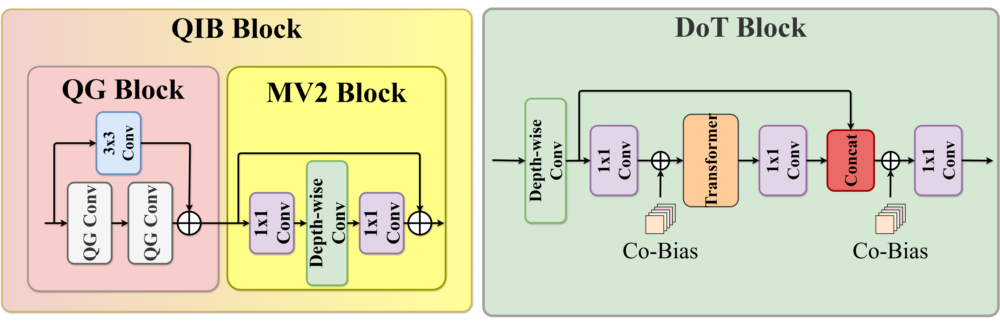
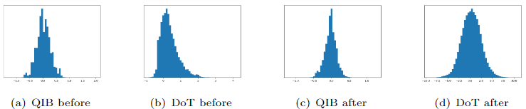

# DoTCoM: High-Performance Mobile Vision Transformers with Co-Bias

This repository contains the Pytorch implementation of  DoTCoM code.

<div align="center">
  
</div>
<p align="center">
  Fig. The proposed QIB and DoT block architecture.
</p>

<div align="center">
  
</div>
<p align="center">
  Fig. 2: The architecture of DoTCoM and DoTCoM Mechanism.
</p>

DoTCoM is a powerful image classification, detection, and segmentation model, which shown in Figure 2.

## Quarter-Inverted Bottleneck (QIB) Block
The Quarter-Inverted Bottleneck (QIB) was proposed, which is a combination of Quarter Groups (QG) and MV2 blocks that demonstrate optimal efficiency in terms of both computation and performance. 

| Block    | Basic |   MV2  |   QG   |   QIB  |
|----------|-------|--------|--------|--------|
| Params   | 11.8M |  4.7M  |  5.6M  |  5.7M  |
| FLOPs    | 1.58G | 0.816G | 0.772G | 0.752G |
| Top-1(%) |  66.2 |  63.9  |  64.5  |  66.2  |
| Latency  | 135ms |  32ms  |  56ms  |  43ms  |

The proposed QIB block achieved the same accuracy as the Basic block. It has 52.41%, 7.84%, and 2.59% fewer FLOPs compared to Basic, MV2, and QG blocks, respectively. 

## Co-opimization Bias (Co-Bias)

Co-optimizing convolutional layers and transformers shows model poses a significant challenge. To address this, we propose the Co-Bias. This approach acknowledges the distinct feature extraction methods of convolution filters and attention mechanisms in Transformer. While convolution applies one filter per channel, the attention mechanism assigns varying weights depending on the position in the input sequence.

<div align="center">
  
</div>
<p align="center">
  Fig. 3: distribution histogram of DoTCoM. “before” means the distribution of activation before Co-Bias is applied, and “after” means the distribution after it is applied.
</p>

### Effects of Co-Bias
| Co-Bias | FLOPs | Params      | Top-1(%) |
| ------- | ----- |------------ |--------- |
| W/      | 3.3G  | 11.1M       | 82.4     |
| W/o     | 3.3G  | 11.1M       | 79.9     |

By tuning the variance between Transformers and convolution on ImageNet-1k, the proposed method achieved a performance of 82.4%, marking 2.43% enhancement in Top-1 accuracy. This table demonstrates the effectiveness of method in boosting performance with minimal hardware cost.

## Results

### ImageNet-1k
| Model        | FLOPs    | Params     | Top-1(%) | Latency  |
| ------------ | -------- | ---------- |--------- |--------- |
| DoTCoM-Tiny  | 0.2G     | 1.7M       | 71.8     | 28ms     |
| DoTCoM-Small | 0.4G     | 2.8M       | 74.8     | 39ms     |
| DoTCoM-Base  | 0.8G     | 5.8M       | 78.3     | 51ms     |

### MS-COCO (Object Detection)
| Model         | Params     | mAP(%)   |
| ------------- | ---------- |--------- |
| MobileViTv1-S | 7.1M       | 23.5     |
| EdgeViT-S     | 6.2M       | 27.9     |
| DoTCoM-Base   | 6.7M       | 24.5     |
| DoTCoM-Large  | 12.9M      | 29.8     |

### PASCAL VOC 2012 (Semantic Segmentation)
| Model           | Params     | mIoU(%)   |
| --------------- | ---------- |---------- |
| DoTCoM-Small    | 3.2M       | 77.5      |
| MobileViTv1-S   | 6.4M       | 79.1      |
| ResNet-101      | 58.2M      | 80.5      |
| DoTCoM-Base     | 6.4M       | 81.3      |
| DoTCoM-Large    | 18.1M      | 83.2      |

### Experiments on Mobile-Processor (Samsung Exynos-2100)
|      Model      | Latency | FLOPs | Params | Top-1(\%) |     Model    | Latency | FLOPs | Params | Top-1(\%) |
|-----------------|---------|-------|--------|-----------|--------------|---------|-------|--------|-----------|
| DeiT            |  150ms  |  1.3G |  5.7M  |    68.7   | MobileViT-S  |   93ms  |  1.8G |  5.6M  |    78.4   |
| MobileViT-XXS   |   57ms  |  0.4G |  1.3M  |    69.0   | RepViT-M0.9  |   57ms  |  0.8G |  5.1M  |    78.7   |
| MobileNetv2     |   25ms  |  0.3G |  2.6M  |    69.8   | FastViT-T12  |  101ms  |  1.4G |  6.8M  |    79.1   |
| SHViT-S1        |   32ms  |  0.2G |  6.3M  |    72.8   | SHViT-S4     |   65ms  |  1.0G |  16.5M |    79.4   |
| CrossViT        |  155ms  |  1.6G |  6.9M  |    73.1   | FastViT-S12  |  108ms  |  1.8G |  8.8M  |    79.8   |
| DoTCoM-T        |   23ms  |  0.4G |  1.7M  |    74.0   | RepViT-M1.0  |   68ms  |  1.1G |  6.8M  |    80.0   |
| EdgeViT-XXS     |   41ms  |  0.56 |  4.1M  |    74.4   | FAT-B1       |  118ms  |  1.2G |  7.8M  |    80.1   |
| MobileViT-XS    |   85ms  |  0.7G |  2.3M  |    74.8   | DoTCoM-B     |   51ms  |  1.6G |  5.8M  |    80.1   |
| SHViT-S2        |   38ms  |  0.4G |  11.4M |    75.2   | FastViT-SA12 |  117ms  |  1.9G |  10.9M |    80.6   |
| FastViT-T8      |   64ms  |  0.7G |  3.6M  |    75.6   | RepViT-M1.1  |   77ms  |  1.3G |  8.2M  |    80.7   |
| EfficientNet-B0 |   52ms  |  0.4G |  5.3M  |    77.1   | EdgeViT-S    |   95ms  |  1.9G |  11.1M |    81.0   |
| SHViT-S3        |   45ms  |  0.6G |  14.2M |    77.4   | FAT-B2       |  189ms  |  2.0G |  13.5M |    81.9   |
| EdgeViT-XS      |   62ms  |  1.1G |  6.7M  |    77.5   | RepViT-M1.5  |  112ms  |  2.3G |  14.0M |    82.3   |
| DoTCoM-S        |   38ms  |  0.8G |  2.8M  |    77.5   | DoTCoM-L     |   93ms  |  3.3G |  11.1M |    82.4   |
| FAT-B0          |   99ms  |  0.7G |  4.5M  |    77.6   |              |         |       |        |           |

## Installation
```
conda create -n DoTCoM python==3.8
conda activate DoTCoM
conda install pytorch==2.3.0 torchvision==0.18.0 torchaudio==2.3.0 cudatoolkit=12.1 -c pytorch

pip install einops
pip install tqdm
```

## Training

```
# 2 gpus, batch size = 128, epoch = 100, learning rate = 1e-3, weight decay = 5e-3, model = DoTCoM-Base
python main.py --model {MODEL_NAME}
```

## Evaluation

```
python main.py --eval --model {MODEL_NAME} --path {/path/to/model.pth}
```


